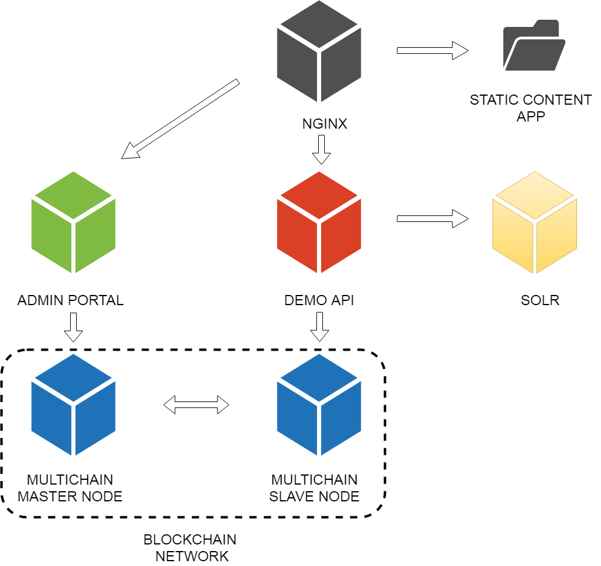

# Bloomen Registry/Clain prototype (Multichain)

This repository offers access to the different tools used in the construction of a demonstrator Multichain based and inspired by music use cases. The demonstrator main focus is the exploration of Multichain capabilities for the registration of data catalogs and changes persistence that these data suffer in order to have a shared ledger as an audit system.

## Objective

Explore Multichain Streams capabilities for musical assets metadata storage with the purpose of creating shared metadata catalogs between different entities which share data through the blockchain.

Use the tokens created within the blockchain to model a claim system that allows communicating and making a shared interactions follow-up between different parties to solve an incidence related to a specific metadata.

## Modules
You can see different modules that we used for the pilot development.

<p align="center">
 
</p>

#### ADMIN PORTAL
Administration portal allows interaction with the blockchain using administration rights to manage different identities permissions created by nodes that collaborate sharing data. This portal allows access to a Multichain functionalities subset in order to allow inspecting information stored within the blockchain.

#### SOLR
The SOLR subsystem allows us to efficiently search the data stored in the blockchain, since otherwise optimal results would not be achieved. SOLR management console allows access to the stored data and make queries about them.

#### SWAGGER
SWAGGER offers us a portal to facilitate interaction with the REST API built for the demonstrator. This REST API allows interaction between user and a blockchain node in a unified way.

#### APP
APP is a small application built with easy interaction purposes for an end user. It uses the REST API to interact with a specific node and its functionalities are wallet management, new data registration in the Streams and Claim creation within the blockchain.

# To view
http://demo2.bloomen.io

# to deploy

> Install Docker version 17.12.1-ce or higher.

> Install Docker-compose version 1.21.2 or higher.

### clone
    git clone https://github.com/bloomenio/bloomen-registry-claim-prototype.git
### install
    cd bloomen-claim-prototype
    docker-compose build
    docker-compose up -d
### enjoy
    http://localhost:8000

		

---
### GANACHE

First of all, It is necessary to launch a Ethereum blockchain, which will allow us to deploy the Smart Contracts.

```console
> ganache-cli -g 0 -p 7545 -l 672197500 -m "YOUR_MNEMONIC" -i 1543827346053
```


### ETHEREUM
Then, we must deploy the Smart Contracts.

```console
> cd ethereum/

> npm run wclean

> npm run development
```

<!-- ### SOLR

virtualbox

. docker_service.sh

cd bloomen-registry-prototype/

docker-compose rm

docker-compose up nginx solr

putty

localhost 2204

tunnels:

L8000 localhost:8000

L8983 localhost:8983   -->              

### API
We must run the api.

```console
> cd api/

> npm run start
```

### APP
We must run the app.

```console
> cd app/

> npm run start
```
